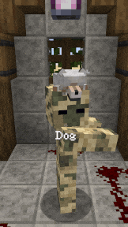
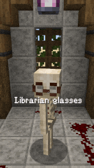
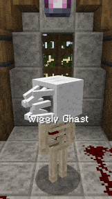
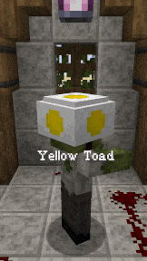
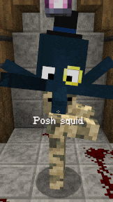
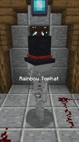

[](https://github.com/psf/black)

# Hats
Minecraft datapack that adds Hats

- [Project structure](#Project_structure)
- [Changelog](https://github.com/OrangeUtan/hats/blob/main/CHANGELOG.md)

<table align="center">
	<tr>
		<td>Accessories</td>
		<td>Animals</td>
		<td>Cats</td>
	</tr>
<table>
<div align="center">
	
	
	
</div>
<table align="center">
	<tr>
		<td>Glasses</td>
		<td>Halloween</td>
		<td>Mario</td>
	</tr>
<table>
<div align="center">
	
	
	
</div>
<table align="center">
	<tr>
		<td>Misc</td>
		<td>Tophats</td>
		<td>Villager</td>
	</tr>
<table>
<div align="center">
	
	
	
</div>

# Project structure
```python
🖿 docs					# Documentation resources
🖿 hats
   🖿 plugins				# Custom beet plugins
   🖿 registries			# Data managers used in all parts of the project
   🗎 options.py				# Wrapper for project options configured in beet.yml
🖿 jinja				# Jinja templating files
   🖿 macros
   🖿 templates
🖿 src
   🖿 datapack
   🖿 resourcepack
   🗎 hats.yml				# Defines hats and their properties
   🗎 cmds.yml				# Assigns custom model data to hats
   🗎 categories.yml			# Split hats into categories. Used in loot tables
   🗎 tags.yml				# Assings tags to hats. Used in loot tables
   🗎 recipes.yml			# Used to generate custom crafting recipes
   🗎 settings.yml			# Used to generate in-game datapack configuration
🗎 beet.yml				# Beet configuration
🗎 beet-release.yml			# Beet configuration for release mode
🗎 .pre-commit-config.yaml 		# Configuration for git commit hooks
🗎 pyproject.toml			# Python project configuration using 'Poetry'
🗎 commit-parser.py			# Custom commit parser. Used for custom CHANGELOG generation
```
