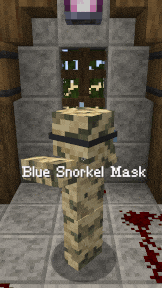
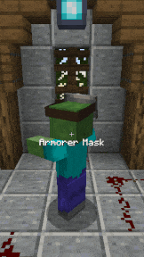

# Hats
Minecraft datapack that adds Hats

## Showcase

<table align="center">
	<tr>
		<td>Accessories</td>
		<td>Animals</td>
		<td>Cats</td>
	</tr>
<table>

	
	
	

<table align="center">
	<tr>
		<td>Glasses</td>
		<td>Halloween</td>
		<td>Mario</td>
	</tr>
<table>

	
	
	

<table align="center">
	<tr>
		<td>Misc</td>
		<td>Tophats</td>
		<td>Villager</td>
	</tr>
<table>

	
	
	

